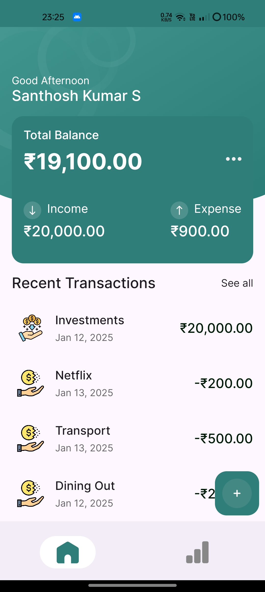

# MONEYtor - Expense Tracker App

**MONEYtor** is an Android application designed to track and manage expenses and incomes. The app supports CRUD (Create, Read, Update, Delete) functionalities for managing financial records in both a local database (SQLite) and Firebase. MONEYtor is built with an **offline-first** approach, ensuring users can track their expenses even when offline, while seamlessly syncing data to the cloud when online.

## Features

- **Offline-First**: The app supports offline usage, allowing users to continue interacting with the app when they are not connected to the internet. Changes made offline are automatically synced when the device is back online.

- **Local Database (SQLite)**: All expenses and income data are stored locally, ensuring that users can access and update their records without needing an internet connection.
  
- **Firebase Integration**: Data syncs with Firebase when the device is online, enabling cloud storage and backup.

- **Automatic Syncing**: Data syncing occurs in the background, with notifications informing users of syncing activities. The sync process ensures that changes in the local database are updated to Firebase, and vice versa.

- **Background Jobs**: The app utilizes background services (workers) to manage syncing tasks, ensuring data is always up-to-date with Firebase, even when the app is not in use.

- **Expense Filtering**: A dedicated screen allows users to filter and view specific expenses and incomes, making it easy to track financial records over time.

- **Stats Screen**: The stats screen provides users with insights into their expenses and incomes, summarizing data to help manage their finances effectively.

- **Expense Table & Pending Operations**: The app maintains two primary tables in the local SQLite database: `expense_table` and `expense_pending_sync_table`. 
    - The `expense_table` stores the core expense records.
    - The `expense_pending_sync_table` stores pending operations (insert, update, delete) performed while offline. These operations are tracked and saved locally, ensuring that the user’s actions are not lost when the app is offline.
    - Once the device is online, background jobs using **WorkManager** automatically sync the changes from the `expense_pending_sync_table` to Firebase, updating the remote database with the offline operations.

## Project Structure

The project is organized into multiple modules to keep the codebase clean and maintainable:

- **background**: Contains classes for handling background services like syncing and notifications.
- **base**: Contains base classes such as ViewModels and events for navigation handling.
- **data**: Manages the database interactions, including the Room Database (DAO) and Firebase database integration.
- **feature**: Contains the features of the app, such as the add_expense, home, stats, and transactionlist modules.
- **notification**: Manages syncing notifications to keep users informed of the sync status.
- **ui**: Contains all UI-related components, including themes and styles.
- **utils**: Provides utility classes for tasks like network connectivity and general utilities.

## Dependencies

- **Kotlin**: The app is written in Kotlin, making use of its modern features.
- **Jetpack Compose**: The UI of the app is built using Jetpack Compose, Android’s modern toolkit for building native UIs. It allows for more intuitive and flexible UI development with less boilerplate code.
- **Firebase**: Firebase is used for remote database syncing.
- **Room Database**: A local database is used for offline storage.
- **WorkManager**: For handling background jobs related to syncing.
- **Notifications**: Push notifications for syncing updates.

## Installation

To run this project locally, follow these steps:

1. Clone the repository:
   ```bash
   git clone https://github.com/Sandy-exe/MoneyTor-Expense-Tracker.git
   ```

2. Open the project in Android Studio.

3. Build and run the app on an emulator or a physical Android device.

4. Ensure you have connected your Firebase project and configured it in your app.

## Usage

- **Track Expenses and Incomes**: Add, update, and delete expenses and incomes on the home screen.
  
- **Syncing**: The app automatically syncs data with Firebase in the background. Users will receive notifications when syncing occurs, indicating whether the sync was successful or if any issues occurred.

- **View Stats**: Navigate to the Stats screen to view a summary of your expenses and incomes, helping you manage your finances more effectively.

- **Offline Mode**: Use the app even without an internet connection. Changes made offline will automatically sync with Firebase once the device is connected to the internet again.

## Screenshots

Here are some screenshots of the app to give you a visual idea of the key features:

<div align="center">
  
  
  
  
  
  
  
</div>

Feel free to check out these images to understand the app layout and design better.

## Video Demo

Check out the demo video of **MONEYtor** showing its key features and functionalities:

1) Basic CRUD and Filter Functionalties:

https://github.com/user-attachments/assets/ca675bc3-96b4-4398-b5ae-93965bea871a

2) Firebase Manual Sync Option


https://github.com/user-attachments/assets/ae87c0d7-f304-44ba-a688-9b075b835dac


## Thanks

Special thanks to [**[Code with FK]**](https://www.youtube.com/watch?v=LfHkAUzup5E) for inspiring this project. Their tutorials and UI ideas provided a great foundation, and I further built upon them with my own concepts to handle online Firebase synchronization, background jobs, and notifications. Their insights played a significant role in shaping the core functionalities of this app. I highly recommend checking out their channel for more learning resources!

## Contributing

If you would like to contribute to this project, please follow these steps:

1. Fork the repository.
2. Create a new branch (`git checkout -b feature-branch`).
3. Make your changes and commit them (`git commit -am 'Add feature'`).
4. Push the branch (`git push origin feature-branch`).
5. Create a pull request.
